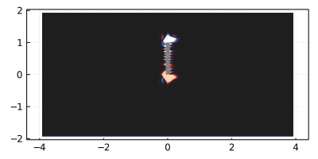

# IBPM.jl

Julia CFD package based on the Immersed Boundary Projection Method (IBPM) from Taira & Colonius (2007), with multigrid method from Colonius & Taira (2008).

Oscillating plate simulated in body-fixed coordinates.

### Overview

The package is generally structured after the hierarchy of the C++ package, with appropriate modifications for Julia (i.e. composite types and multiple dispatch instead of object-oriented).  

* __Bodies__: the bodies are a collection of boundary points at which the no-slip conditions are enforced, along with a Motion (currently only Static "motion" is supported).  The `structure-domain/sample-bodies.jl` file also has utilities to make a couple of basic bodies (a cylinder and 4-digit NACA airfoils, for instance).
* __Model__: the model is a structure to hold information about the domain - the grid, an array of bodies, pre-allocated working memory, and any matrices and operators that can be precomputed.  In other words, everything short of the time discretization belongs to the Model
* __Problem__: Ideally this could interface with the DifferentialEquations.jl package eventually, so a "IBProblem" is defined in the same spirit as the "ODEProblem".  This combines a Model with precomputed operators relevant for advancing the state.
* __State__: This is just a collection of pre-allocated arrays to store the vorticity, streamfunction, velocity flux, and body forces (including lift and drag).  It also has storage for the "memory" of the multi-step scheme for the nonlinear terms.  

Once a Problem and State are defined, the basic time-stepping is to just call `advance!(state, prob, t)`.  There are also some helpful functions in `ibpm.jl` to run the full simulation, for instance to save a GIF of the solution.  See the "examples" folder for several cases.

### Current Status (4/22/21)
Currently only rigid bodies have been implemented, although a single moving body can be simulated by moving the grid (a "body-fixed" reference frame, although the equations are in the inertial lab frame).  The reference cases (see the benchmarks folder) match the Fortran implementation to within $10^{-6}$ relative error, but with an average of about 40% speedup (and slightly more compared to the C++ code).

The next plans include arbitrary motion (with a fixed grid), parallelization, and adding an FSI solver for flexible bodies.