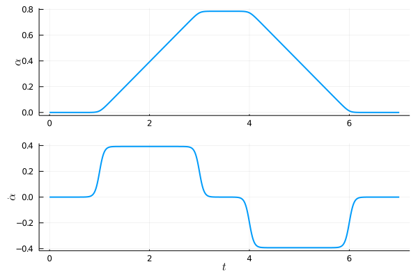
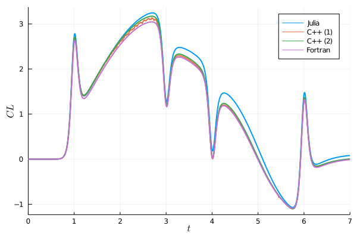

# Canonical pitch-hold maneuver

Parameters have been chosen as in 3.4.1 of Steve's thesis (and see Figure 3.8).
Current results are for pitching about the leading edge, but this should be
changed to quarter chord.

There are four relevant scripts here:

1. `setup_prob.jl` - Initialize shared variables (to make sure all scripts will use the same grid and body definitions)
2. `steady_bl.jl` - Solve steady boundary layer flow over the flate plate at zero angle of attack
3. `pitching_maneuver.jl` - Full pitch-hold maneuver with moving grid formulation
4. `plot_results.jl` - Load and plot $C_L$ comparison against C++ and Fortran implementations.

### Flat plate boundary layer

The first part of this is the steady solution of a fully developed boundary layer over the plate.  
The Blasius prediction is 0.2256, but that's assuming parallel flow, i.e. no pressure drag.

| Package      |  $C_D$ |
| ----------- |  -----|
| Julia | 0.3988 |
| Fortran | 0.3952 |
| C++ | 0.3828 |

### $C_L$ comparison

### Time benchmarks

| Package      | Runtime (secs)  |
| ----------- | ----------- | ----------- |
| C++ (lab frame)  |  28045   |
| C++ (body-fixed)  |    1759 |
| Fortran | 1601  |
| Julia    |  1213  |

30% speedup over C++ and 25% over Fortran!
